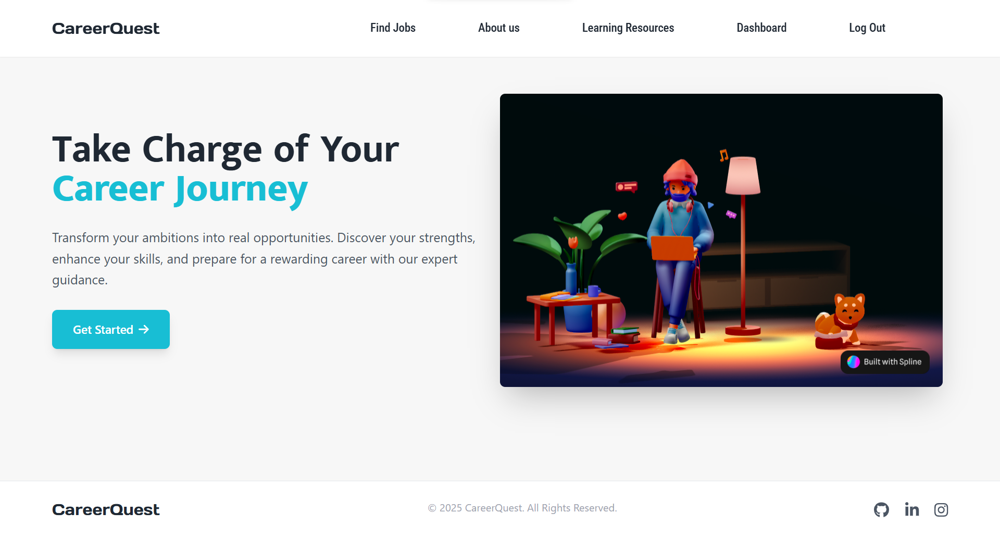
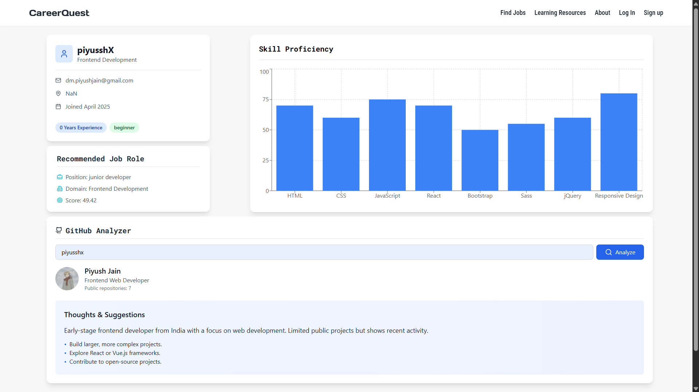
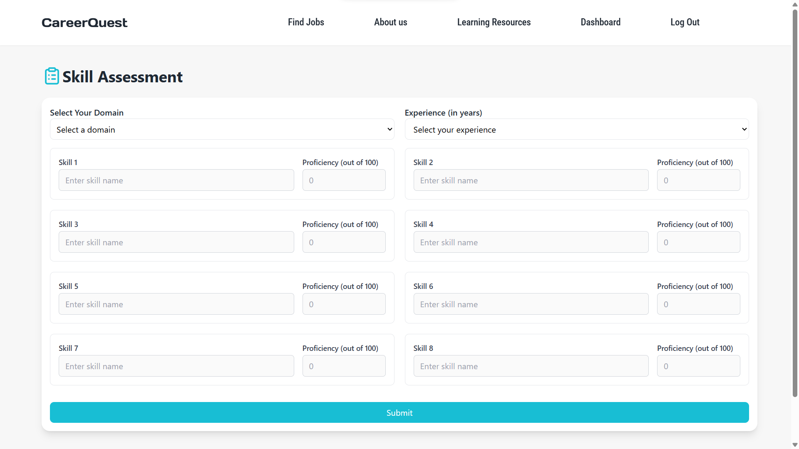
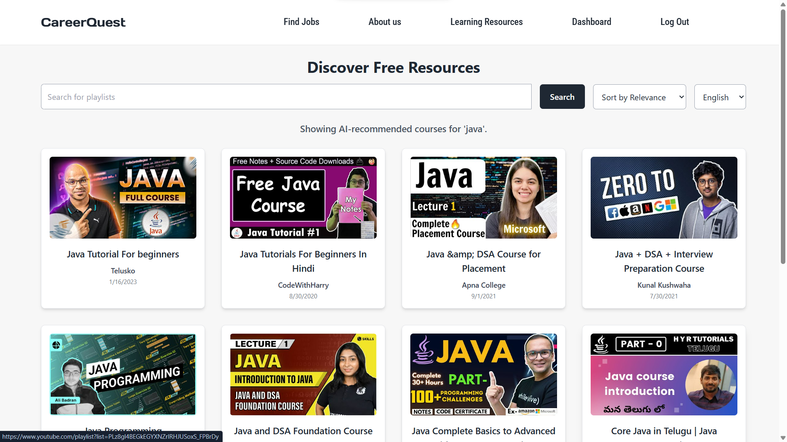

# CareerQuest

**AI-Powered Career Guidance Platform**

CareerQuest is an AI-driven platform designed to simplify career selection. It assesses users' skills, recommends suitable job roles, and provides access to free online learning resources, empowering users to make informed career decisions.

## 🚀 Features

- **AI-Powered Skill Assessment** – Identify strengths and areas for improvement.
- **Personalized Career Recommendations** – Get job role suggestions based on skills.
- **Free Learning Resources** – Access curated online materials to upskill.
- **User-Friendly Interface** – Simple and intuitive design for easy navigation.
- **Real-Time Insights** – Dynamic career mapping for continuous growth.

## 📸 Images/Demo
### Home Page
 
### Dashboard
   
### Skill Assessment
  
### Learning Resources
  

## 🔧 How It Works

1. **Skill Assessment** – Users take a quick AI-powered test to analyze their skills.
2. **Career Matching** – AI suggests job roles best suited for the user.
3. **Learning Resources** – Users get access to relevant online resources.
4. **Continuous Improvement** – Track progress and refine career paths.

## 💡 Why Choose CareerQuest?

- **Free & Accessible** – No cost, open to everyone.
- **AI-Driven Personalization** – Tailored career paths based on real skills.
- **Self-Paced Learning** – Improve at your own pace with curated resources.

## 📌 Future Scope

- Advanced AI models for deeper skill analysis.
- Integration with job portals for real-time opportunities.
- Personalized mentorship & community support.

## 📬 Contact

For inquiries or collaboration, reach out at **dm.piyushjain@gmail.com or dm.mayankjain@gmail.com**.

---

*Empower your future with CareerQuest!* 🚀
